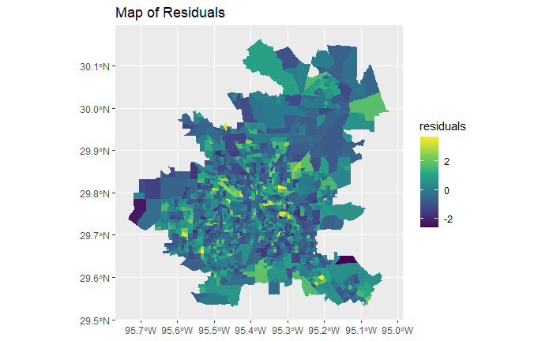
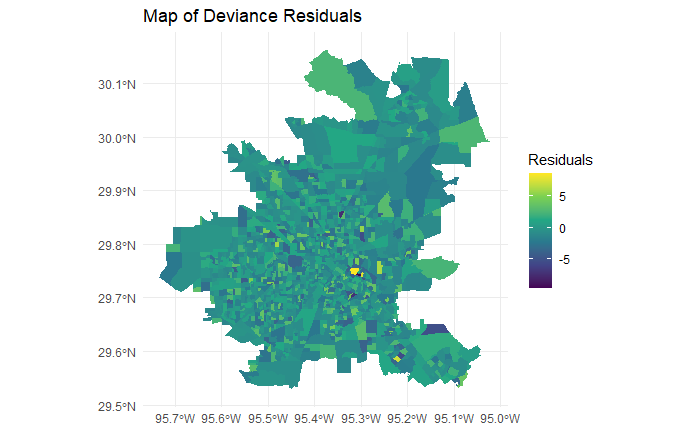

# heat-mortality

### Overview
This repository contains an analysis of heat-related mortality in Houston. The data look like this:

| Count | Population | NOAC | MED_AGE | HispanicPC | BlackPCT | under5PCT | over65PCT | povertyPCT | alonePCT | MinTemp | geometry                       |
|-------|------------|------|---------|------------|----------|-----------|-----------|------------|----------|---------|--------------------------------|
| 1     | 806        | 0    | 42.0    | 0.18       | 0.05     | 0.04      | 0.17      | 0.04       | 0.05     | 24.821  | MULTIPOLYGON (((-95.30797 2... |
| 2     | 3139       | 0    | 34.7    | 0.11       | 0.12     | 0.07      | 0.05      | 0.05       | 0.02     | 24.301  | MULTIPOLYGON (((-95.59792 2... |
| 3     | 3055       | 0    | 39.1    | 0.09       | 0.25     | 0.06      | 0.06      | 0.04       | 0.03     | 24.446  | MULTIPOLYGON (((-95.52326 2... |
| 4     | 1272       | 0    | 24.7    | 0.67       | 0.29     | 0.11      | 0.03      | 0.31       | 0.01     | 24.735  | MULTIPOLYGON (((-95.45417 2... |
| 5     | 2786       | 0    | 31.5    | 0.08       | 0.86     | 0.08      | 0.03      | 0.11       | 0.07     | 24.598  | MULTIPOLYGON (((-95.51841 2... |
| 6     | 2438       | 0    | 27.0    | 0.29       | 0.68     | 0.08      | 0.03      | 0.08       | 0.03     | 24.714  | MULTIPOLYGON (((-95.46127 2... |

The observational unit is a block (or group of blocks). The `Count` variable is the number of heat-related deaths on the block, which we are trying to predict.

### The Incorrect Approach
Suppose we have a basic linear model.

```r
heat_lm <- lm(log_count ~ NOAC + MED_AGE + HispanicPC + BlackPCT + under5PCT + over65PCT + povertyPCT + alonePCT + MinTemp + Population, data = heat)
```

The formula for this model is a simple $Y = X\beta + \epsilon$. Where $Y$ is a vector of the death count, $X$ is a matrix of the explanatory variables, $\beta$ is a vector of the estimated coefficients, and $\epsilon$ is a vector of the residuals.

A map of the residuals for this model looks like this:


This map shows patches of yellow and blue, suggesting spatial correlation. The linear model incorrectly assumes that each observation is independent from each other when this is most likely not the case.

### A Better Approach
To start, Poisson regression is better suited to handle count data. Using the geometry of the blocks provided in the data, we can estimate Moran's I spatial bases to factor in a spatial weight matrix that will measure the correlation between blocks.

The formula for this model is a lot more complex:

$$
Y_i \sim \text{Pois}(\lambda_i)
$$

$$
\log(\lambda_i) = x_i'\beta + b_i'\theta
$$

- **$\log(\lambda_i)$**: The natural logarithm of the expected heat-related morbidity count, ensuring positive values of $\lambda_i$.
- **$x_i'$**: The transpose of the vector of covariates for the $i$-th unit, including all 10 explanatory variables from the dataset.
- **$\beta$**: Coefficients for the covariates, quantifying the effect of each covariate on the expected count.

For example, if the value of the $\beta_{\text{medianAge}}$ coefficient is 0.2, the interpretation would be:
$$
\text{For a one-unit increase in the median age, the expected count of events, } \lambda_i, \text{ is multiplied by } e^{0.2} \approx 1.22.
$$
This means that the expected count increases by 22% for every one year increase in median age, assuming all other variables are held constant.

- **$b_i'$**: The transpose of the vector of spatial random effects for the $i$-th unit, capturing unobserved spatial variability. It is a linear combination of $\sum_k \theta_k b_k(s_i)$.
- **$b_k(s)$**: Defined as a Gaussian kernel centered at location $s_k$:

$$
b_k(s) = \frac{1}{\sqrt{2\pi v}} \exp\left(-\frac{1}{2v} (s - s_k)^T (s - s_k)\right)
$$

This equation represents the spatial basis function at a point $s$, where $s_k$ is the center of the $k$-th basis function. The parameter $v$ controls the variance or the spread of the kernel.

- **$\theta$**: Coefficients for the spatial random effects, indicating the influence of spatial structure on the morbidity counts.

This map shows the residuals after incorporating these elements:

